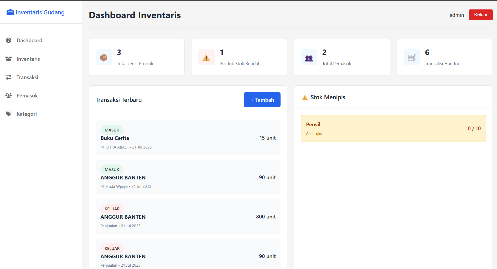

# Aplikasi Inventaris Gudang (Django)

Sebuah aplikasi web berbasis Django untuk manajemen inventaris gudang. Aplikasi ini memungkinkan pengguna melacak barang, pemasok, kategori, dan transaksi stok masuk/keluar dalam antarmuka yang bersih dan modern.

---

## ✨ Fitur Utama

- **Dashboard Interaktif**: Menampilkan ringkasan statistik penting seperti total produk, produk dengan stok rendah, jumlah pemasok, dan transaksi hari ini.
- **Manajemen Barang (CRUD)**: Fungsionalitas penuh untuk Tambah, Baca, Edit, dan Hapus data barang, termasuk informasi SKU, stok minimum, harga beli, dan harga jual.
- **Manajemen Kategori & Pemasok**: CRUD lengkap untuk mengelola kategori produk dan data pemasok.
- **Sistem Transaksi**: Mencatat semua pergerakan stok (masuk dan keluar). Stok barang akan otomatis diperbarui setiap kali transaksi dibuat.
- **Otentikasi Pengguna**: Sistem login dan logout yang aman. Halaman-halaman penting dilindungi dan hanya bisa diakses setelah login.
- **Filter & Pencarian Dinamis**: Kemampuan untuk mencari dan memfilter data pada halaman daftar barang dan transaksi untuk analisis yang lebih mudah.
- **Paginasi**: Halaman daftar secara otomatis membagi data menjadi beberapa halaman untuk performa yang lebih baik.
- **Antarmuka Kustom**: Desain yang dibuat khusus dengan CSS, bukan mengandalkan *template* admin bawaan.

---

## Screenshot



---

##  Teknologi yang Digunakan

- **Backend**: Python, Django
- **Database**: SQLite 3 (Database default Django)
- **Frontend**: HTML, CSS
- **Python Libraries**:
    - `django-humanize` (untuk format angka agar mudah dibaca)

---

##  Instalasi dan Setup

Berikut adalah cara untuk menjalankan proyek ini di lingkungan lokal Anda.

1.  **Clone Repository**
    ```bash
    git clone https://github.com/rahmatsuhadi/fp-inventaris-gudang
    
    cd fp-inventaris-gudang
    ```

2.  **Buat dan Aktifkan Virtual Environment**
    ```bash
    # Membuat venv
    python -m venv venv

    # Mengaktifkan di Windows
    venv\Scripts\activate

    # Mengaktifkan di macOS/Linux
    source venv/bin/activate
    ```

3.  **Buat File `requirements.txt` (Jika Belum Ada)**
    Jika Anda belum memiliki file ini, buat dengan perintah berikut untuk mendaftarkan semua *library* yang telah Anda install:
    ```bash
    pip freeze > requirements.txt
    ```

4.  **Install Semua Dependensi**
    ```bash
    pip install -r requirements.txt
    ```

5.  **Jalankan Migrasi Database**
    Perintah ini akan membuat file database `db.sqlite3` dan semua tabel yang dibutuhkan.
    ```bash
    python manage.py migrate
    ```

6.  **Buat Superuser (Akun Admin)**
    Anda akan memerlukan akun ini untuk login pertama kali.
    ```bash
    python manage.py createsuperuser
    ```
    Ikuti petunjuk untuk membuat username, email, dan password.

---

##  Menjalankan Aplikasi

1.  **Jalankan Development Server**
    ```bash
    python manage.py runserver
    ```

2.  **Buka Aplikasi**
    Buka browser Anda dan kunjungi **`http://120.0.1:8000/`**. Anda akan diarahkan ke halaman login. Gunakan akun superuser yang telah Anda buat untuk masuk.

---

##  Lisensi

Proyek ini dilisensikan di bawah Lisensi MIT.

---
Dibuat oleh **[Nama Anda]**
